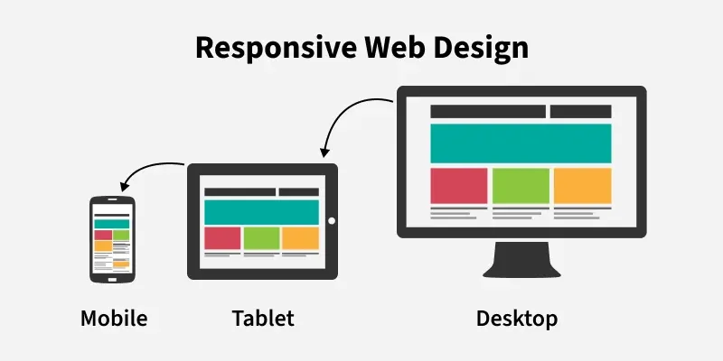
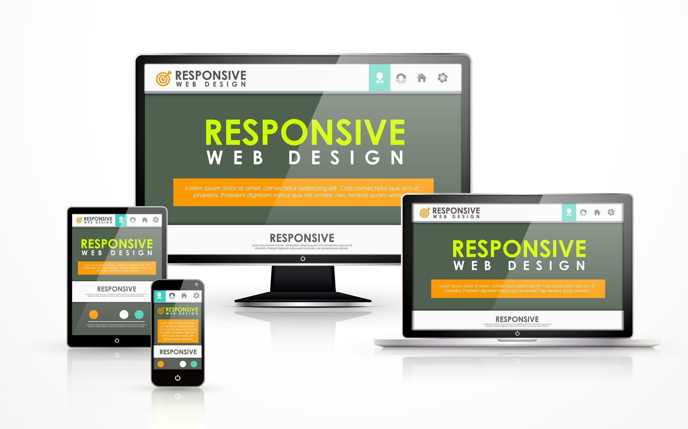

# create a responsive content look like this 




# create another responsive layout 




# create another responsive layout 


```
 for chrome ...ctrl + shift + i 
 for firefox ...ctrl + shift + m 

```